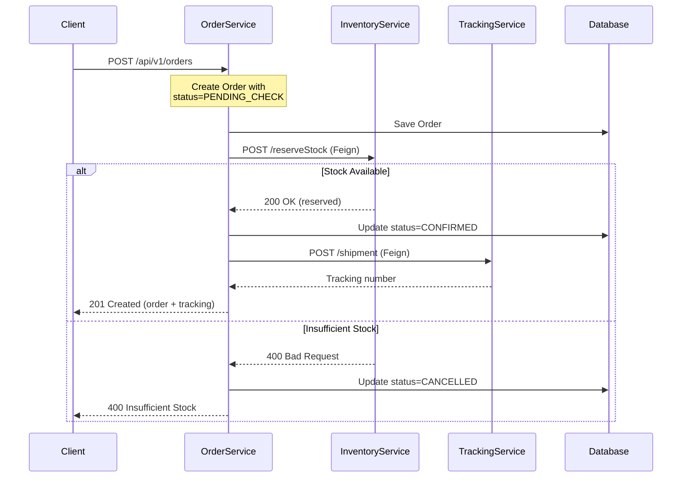

## Overview

The Order Service is the entry point for customer purchases. It validates customer data, creates order records, and orchestrates the order fulfillment process by coordinating with Inventory and Tracking services.

<Info>
  **Port:** 8090 | **Database:** PostgreSQL (orderdb) | **Eureka Name:** msvc-order
</Info>

## Responsibilities

<CardGroup cols={2}>
  <Card title="Order Creation" icon="plus">
    Accept and validate customer order requests with order items
  </Card>
  <Card title="Stock Coordination" icon="handshake">
    Call Inventory Service via Feign to validate and reserve stock
  </Card>
  <Card title="Shipment Initialization" icon="truck">
    Trigger Tracking Service to create shipment records
  </Card>
  <Card title="Lifecycle Management" icon="rotate">
    Manage order state transitions (PENDING → CONFIRMED → SHIPPED → DELIVERED/CANCELLED)
  </Card>
</CardGroup>

## Why PostgreSQL?

PostgreSQL was chosen for the Order Service for specific technical reasons:

<AccordionGroup>
  <Accordion title="ACID Compliance">
    Orders are transactional in nature. PostgreSQL's strong ACID guarantees ensure that:
    - Order and order items are created atomically
    - No partial orders exist in the database
    - Concurrent order creation is handled safely
    - Data integrity is maintained during failures
  </Accordion>

  <Accordion title="Complex Relationships">
    Order data has complex relational structures:
    - One-to-many relationship between Order and OrderItem
    - Foreign key constraints to maintain referential integrity
    - Join queries for order reporting and analytics
    - Support for complex queries across customers and orders
  </Accordion>

  <Accordion title="Proven Reliability">
    PostgreSQL is battle-tested for mission-critical transactional systems with excellent performance for read/write workloads.
  </Accordion>
</AccordionGroup>

## Domain Model

Based on the technical specification, the Order Service implements the following data model:

### Order Entity

```java
// Expected domain model structure
public class Order {
    private Long id;                    // Primary key
    private String orderNumber;         // UUID for public tracking
    private Long customerId;            // Customer reference
    private LocalDateTime orderDate;    // Order creation timestamp
    private OrderStatus status;         // Order lifecycle state
    private BigDecimal totalPrice;      // Total order value
    private List<OrderItem> items;      // Order line items
}
```

**Order States:**

```java
public enum OrderStatus {
    PENDING_CHECK,   // Initial state, awaiting stock validation
    CONFIRMED,       // Stock reserved, order confirmed
    SHIPPED,         // Order dispatched to customer
    DELIVERED,       // Successfully delivered
    CANCELLED        // Order cancelled (releases stock)
}
```

### OrderItem Entity

```java
public class OrderItem {
    private Long id;
    private Long productId;            // References Inventory Service product
    private Integer quantity;          // Quantity ordered
    private BigDecimal priceAtPurchase; // Price snapshot at order time
}
```

<Warning>
  **Price Snapshot**: Order items store `priceAtPurchase` rather than referencing current product price. This ensures order history accuracy even when prices change.
</Warning>

## Service Communication

### Inter-Service Calls with OpenFeign

The Order Service orchestrates the order creation workflow using synchronous Feign calls:



### Feign Client Example

```java
package com.microservice.order.infrastructure.client;

import org.springframework.cloud.openfeign.FeignClient;
import org.springframework.web.bind.annotation.PostMapping;
import org.springframework.web.bind.annotation.RequestBody;

/**
 * Feign client for Inventory Service communication.
 * Uses Eureka service discovery to locate inventory service.
 */
@FeignClient(name = "msvc-inventory", path = "/api/v1/inventory")
public interface InventoryClient {
    
    @PostMapping("/reserve")
    InventoryResponse reserveStock(
        @RequestBody InventoryRequest request);
    
    @PostMapping("/release")
    void releaseStock(@RequestBody InventoryRequest request);
}

/**
 * DTO for inventory stock requests.
 */
public class InventoryRequest {
    private List<StockItem> items;
    
    public static class StockItem {
        private Long productId;
        private Integer quantity;
    }
}

/**
 * DTO for inventory responses.
 */
public class InventoryResponse {
    private boolean success;
    private String message;
    private List<String> unavailableProducts;
}
```

### Tracking Service Client

```java
package com.microservice.order.infrastructure.client;

import org.springframework.cloud.openfeign.FeignClient;
import org.springframework.web.bind.annotation.PostMapping;

/**
 * Feign client for Tracking Service.
 */
@FeignClient(name = "msvc-tracking", path = "/api/v1/tracking")
public interface TrackingClient {
    
    @PostMapping("/shipment")
    TrackingResponse createShipment(
        @RequestBody TrackingRequest request);
}

public class TrackingRequest {
    private Long orderId;
    private String customerName;
    private String deliveryAddress;
    private String carrier;
}

public class TrackingResponse {
    private String trackingNumber;
    private String estimatedDelivery;
}
```

## Expected API Endpoints

Base URL: `http://localhost:8090/api/v1/orders`

<AccordionGroup>
  <Accordion title="POST / - Create Order">
    Creates a new order and coordinates with inventory and tracking services.

    **Request Body:**
    ```json
    {
      "customerId": 12345,
      "items": [
        {
          "productId": 1,
          "quantity": 2
        },
        {
          "productId": 5,
          "quantity": 1
        }
      ],
      "deliveryAddress": "123 Main St, City, State 12345",
      "carrier": "DHL"
    }
    ```

    **Success Response (201 Created):**
    ```json
    {
      "orderId": 789,
      "orderNumber": "ORD-550e8400-e29b-41d4-a716-446655440000",
      "customerId": 12345,
      "status": "CONFIRMED",
      "totalPrice": 349.97,
      "orderDate": "2026-03-08T14:30:00",
      "trackingNumber": "TRK-f47ac10b-58cc-4372-a567-0e02b2c3d479",
      "items": [
        {
          "productId": 1,
          "quantity": 2,
          "priceAtPurchase": 99.99
        },
        {
          "productId": 5,
          "quantity": 1,
          "priceAtPurchase": 149.99
        }
      ]
    }
    ```

    **Error Response (400 Bad Request):**
    ```json
    {
      "error": "Insufficient stock",
      "unavailableProducts": [1],
      "message": "Product ID 1 has insufficient stock"
    }
    ```
  </Accordion>

  <Accordion title="GET /{id} - Get Order Details">
    Retrieves order information by ID.

    **Response:**
    ```json
    {
      "orderId": 789,
      "orderNumber": "ORD-550e8400-e29b-41d4-a716-446655440000",
      "customerId": 12345,
      "status": "SHIPPED",
      "totalPrice": 349.97,
      "orderDate": "2026-03-08T14:30:00",
      "trackingNumber": "TRK-f47ac10b-58cc-4372-a567-0e02b2c3d479"
    }
    ```
  </Accordion>

  <Accordion title="GET /customer/{customerId} - Get Customer Orders">
    Retrieves all orders for a specific customer.

    **Response:**
    ```json
    [
      {
        "orderId": 789,
        "orderNumber": "ORD-550e8400-e29b-41d4-a716-446655440000",
        "status": "DELIVERED",
        "totalPrice": 349.97,
        "orderDate": "2026-03-08T14:30:00"
      }
    ]
    ```
  </Accordion>

  <Accordion title="PUT /{id}/cancel - Cancel Order">
    Cancels an order and releases reserved stock.

    **Response:** 204 No Content

    **Side Effects:**
    - Order status updated to CANCELLED
    - Inventory Service called to release reserved stock
  </Accordion>

  <Accordion title="PUT /{id}/ship - Mark as Shipped">
    Updates order status to SHIPPED and consumes reserved stock.

    **Response:** 204 No Content
  </Accordion>
</AccordionGroup>

## Database Configuration

```yaml
server:
  port: 8090

spring:
  application:
    name: msvc-order
  datasource:
    driver-class-name: org.postgresql.Driver
    url: jdbc:postgresql://order_db:5432/orderdb
    username: postgres
    password: password
  jpa:
    hibernate:
      ddl-auto: create
    database: postgresql
    database-platform: org.hibernate.dialect.PostgreSQLDialect
  config:
    import: "optional:configserver:http://localhost:8888"

eureka:
  instance:
    hostname: eureka-server
  client:
    service-url:
      defaultZone: http://${eureka.instance.hostname}:8761/eureka/
```

<Info>
  The service connects to PostgreSQL running in Docker container `order_db` on port 5432.
</Info>

## Order Workflow

<Steps>
  <Step title="Client Submits Order">
    Customer sends order creation request with items and delivery details.
  </Step>

  <Step title="Order Persisted with PENDING_CHECK">
    Order Service saves order to PostgreSQL with initial status.
  </Step>

  <Step title="Stock Reservation">
    Order Service calls Inventory Service via Feign to reserve stock for all items.
  </Step>

  <Step title="Stock Validation">
    If stock is insufficient, order status changes to CANCELLED and error is returned.
    
    If stock is available, Inventory Service reserves the quantities and order continues.
  </Step>

  <Step title="Shipment Creation">
    Order Service calls Tracking Service to initialize shipment tracking.
  </Step>

  <Step title="Order Confirmed">
    Order status updated to CONFIRMED. Client receives order ID and tracking number.
  </Step>

  <Step title="Order Shipped">
    When order ships, status updates to SHIPPED. Inventory Service confirms reservation (reduces total stock).
  </Step>

  <Step title="Delivery Confirmation">
    Tracking Service updates delivery status. Order marked as DELIVERED.
  </Step>
</Steps>

## Architecture Pattern

While the Order Service is simpler than Inventory Service, it should still follow hexagonal architecture principles:

```text
com.microservice.order/
├── domain/
│   ├── model/
│   │   ├── Order.java
│   │   ├── OrderItem.java
│   │   └── OrderStatus.java (enum)
│   └── exception/
│       └── DomainException.java
├── application/
│   ├── port/
│   │   ├── input/
│   │   │   └── CreateOrderUseCase.java
│   │   └── output/
│   │       ├── OrderRepository.java
│   │       ├── InventoryClient.java
│   │       └── TrackingClient.java
│   └── service/
│       └── CreateOrderService.java
└── infrastructure/
    ├── adapter/
    │   ├── input/
    │   │   └── rest/
    │   │       └── OrderController.java
    │   └── output/
    │       ├── persistence/
    │       │   ├── OrderEntity.java
    │       │   ├── OrderItemEntity.java
    │       │   └── OrderRepositoryAdapter.java
    │       └── client/
    │           ├── InventoryFeignClient.java
    │           └── TrackingFeignClient.java
    └── config/
```

## Error Handling

<AccordionGroup>
  <Accordion title="Insufficient Stock">
    **Scenario**: Inventory Service returns 400 indicating insufficient stock.

    **Handling**:
    - Order status set to CANCELLED
    - Return 400 to client with specific product IDs that are unavailable
    - No tracking shipment created
  </Accordion>

  <Accordion title="Inventory Service Unavailable">
    **Scenario**: Inventory Service is down (Feign timeout/circuit breaker).

    **Handling**:
    - Order remains in PENDING_CHECK status
    - Return 503 Service Unavailable to client
    - Client should retry
    - Consider implementing retry logic with exponential backoff
  </Accordion>

  <Accordion title="Tracking Service Unavailable">
    **Scenario**: Tracking Service fails after stock is reserved.

    **Handling**:
    - Order status remains CONFIRMED (stock is reserved)
    - Tracking number can be generated later via background job
    - Return partial success to client with warning
    - Implement compensating transaction to create tracking later
  </Accordion>
</AccordionGroup>

## Future Enhancements

<CardGroup cols={2}>
  <Card title="Saga Pattern" icon="diagram-project">
    Implement distributed transactions with saga pattern for better failure handling and compensation.
  </Card>

  <Card title="Event-Driven Architecture" icon="bolt">
    Replace synchronous Feign calls with asynchronous events using Kafka or RabbitMQ.
  </Card>

  <Card title="Circuit Breaker" icon="shield-halved">
    Add Resilience4j circuit breaker to handle downstream service failures gracefully.
  </Card>

  <Card title="CQRS" icon="split">
    Separate read and write models for better scalability and performance.
  </Card>
</CardGroup>

## Related Services

<CardGroup cols={3}>
  <Card title="Inventory Service" icon="boxes-stacked" href="/microservices/inventory-service">
    Called to validate and reserve stock
  </Card>
  <Card title="Tracking Service" icon="location-dot" href="/microservices/tracking-service">
    Called to initialize shipment tracking
  </Card>
  <Card title="Architecture Overview" icon="sitemap" href="/microservices/overview">
    Learn about the overall system design
  </Card>
</CardGroup>
