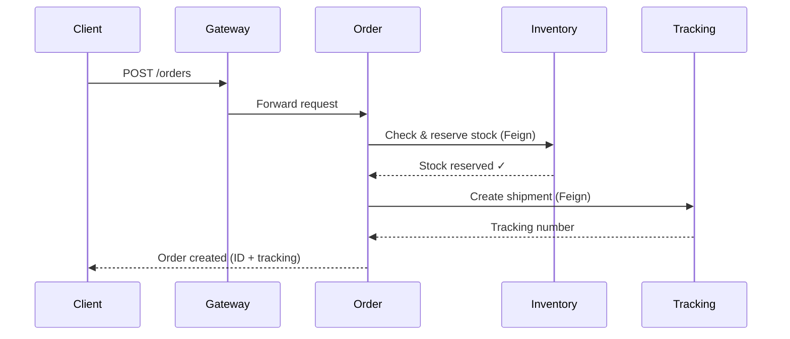

## System Overview

StreamLine Logistics implements a microservices architecture to manage the complete order lifecycle from creation to final delivery. The system ensures stock consistency and provides real-time package tracking capabilities.

<Card title="Core Services" icon="cubes">
  The platform consists of three domain-driven microservices:
  - **Order Service** - Manages customer orders and order lifecycle
  - **Inventory Service** - Controls product stock and reservations
  - **Tracking Service** - Records shipment events and delivery status
</Card>

## Hexagonal Architecture (Ports & Adapters)

All microservices follow the **Hexagonal Architecture** pattern (also known as Ports and Adapters), which provides clear separation between business logic and external concerns.

<Accordion title="What is Hexagonal Architecture?">
  Hexagonal Architecture organizes code into three main layers:

  **1. Domain Layer (Core)**
  - Contains pure business logic and domain models
  - No dependencies on frameworks or infrastructure
  - Implements domain rules and validations
  - Uses immutable entities and value objects

  **2. Application Layer (Use Cases)**
  - Orchestrates domain objects to fulfill use cases
  - Defines input and output ports (interfaces)
  - Implements application services
  - Handles cross-cutting concerns like transactions

  **3. Infrastructure Layer (Adapters)**
  - Implements ports defined in application layer
  - Contains framework-specific code
  - Input adapters: REST controllers, message consumers
  - Output adapters: Database repositories, external API clients

  This separation allows you to:
  - Test business logic without databases or web servers
  - Swap infrastructure implementations easily
  - Delay technical decisions (database choice, messaging, etc.)
  - Keep domain logic clean and focused
</Accordion>

### Package Structure Example (Inventory Service)

```text
com.microservice.inventory/
├── domain/                          # Core business logic
│   ├── model/
│   │   ├── Product.java            # Domain entity
│   │   ├── Stock.java              # Domain entity
│   │   └── ProductDetails.java     # Aggregate
│   ├── valueobject/
│   │   ├── Sku.java                # Value object
│   │   └── Price.java              # Value object
│   └── exception/
│       └── DomainException.java
│
├── application/                     # Use cases & ports
│   ├── port/
│   │   ├── input/                  # Use case interfaces
│   │   │   ├── CreateProductUseCase.java
│   │   │   ├── GetProductDetailsUseCase.java
│   │   │   └── UpdateStockUseCase.java
│   │   └── output/                 # Repository interfaces
│   │       ├── ProductRepository.java
│   │       └── StockRepository.java
│   ├── service/                    # Use case implementations
│   │   ├── CreateProductService.java
│   │   ├── GetProductService.java
│   │   └── UpdateStockService.java
│   ├── dto/
│   └── mapper/
│
└── infrastructure/                  # Framework & adapters
    └── adapter/
        ├── input/
        │   └── rest/               # REST API (input adapter)
        │       ├── ProductController.java
        │       └── mapper/
        └── output/
            └── persistence/        # Database (output adapter)
                ├── Product/
                │   ├── ProductEntity.java
                │   ├── JpaProductRepository.java
                │   └── ProductRepositoryAdapter.java
                └── Stock/
```

<Info>
  **Key Principle**: Dependencies point inward. The domain layer has zero external dependencies. Infrastructure depends on application, which depends on domain.
</Info>

## Technology Stack

| Component | Technology | Purpose |
|-----------|------------|----------|
| **Framework** | Spring Boot 3.x | Microservice foundation |
| **Service Discovery** | Netflix Eureka | Dynamic service registration |
| **API Gateway** | Spring Cloud Gateway | Unified entry point (port 8080) |
| **Config Server** | Spring Cloud Config | Centralized configuration (port 8888) |
| **Communication** | OpenFeign | Synchronous inter-service calls |
| **Databases** | PostgreSQL, MySQL, MongoDB | Polyglot persistence |
| **Orchestration** | Docker Compose | Multi-container deployment |

## Infrastructure Components

<CardGroup cols={2}>
  <Card title="Eureka Server" icon="radar">
    **Port:** 8761
    
    Service registry and discovery. All microservices register themselves on startup and can discover other services dynamically.
  </Card>

  <Card title="Config Server" icon="gear">
    **Port:** 8888
    
    Centralized configuration management. Stores YAML configuration files for all services, supporting environment-specific profiles.
  </Card>

  <Card title="API Gateway" icon="door-open">
    **Port:** 8080
    
    Single entry point for external clients. Handles routing, security, and cross-cutting concerns like authentication and rate limiting.
  </Card>
</CardGroup>

## Database Per Service Pattern

Each microservice owns its database to ensure loose coupling and independent scalability:

<AccordionGroup>
  <Accordion title="Order Service - PostgreSQL (Port 5432)">
    **Why PostgreSQL?**
    - ACID compliance for transactional integrity
    - Strong support for complex relationships (orders, order items, customers)
    - Excellent performance for relational data

    **Database:** `orderdb`
  </Accordion>

  <Accordion title="Inventory Service - MySQL (Port 3306)">
    **Why MySQL?**
    - High performance for read/write operations on master data
    - Proven reliability for product catalogs
    - Excellent concurrent access handling

    **Database:** `inventorydb`
  </Accordion>

  <Accordion title="Tracking Service - MongoDB (Port 27017)">
    **Why MongoDB (NoSQL)?**
    - Schema-less design for flexible event data
    - Different tracking events need different fields (GPS coordinates, photos, customs data)
    - High write throughput for event streaming
    - Natural fit for event sourcing patterns

    **Database:** `trackingdb`
  </Accordion>
</AccordionGroup>

<Warning>
  **Database Isolation**: Services communicate ONLY through APIs, never by directly accessing another service's database. This prevents tight coupling and maintains service autonomy.
</Warning>

## Service Communication Flow

The system uses **synchronous communication** via OpenFeign for Phase 1:



<Steps>
  <Step title="Client Request">
    User sends order creation request through API Gateway
  </Step>
  <Step title="Stock Validation">
    Order Service calls Inventory Service via Feign to validate and reserve stock
  </Step>
  <Step title="Shipment Initialization">
    If stock is available, Order Service calls Tracking Service to create shipment
  </Step>
  <Step title="Response">
    Client receives order ID and tracking number
  </Step>
</Steps>

## Service Endpoints

| Service | Port | Base Path | Eureka Name |
|---------|------|-----------|-------------|
| Order Service | 8090 | `/api/v1/orders` | `msvc-order` |
| Inventory Service | 9090 | `/api/v1/inventory` | `msvc-inventory` |
| Tracking Service | 8091 | `/api/v1/tracking` | `msvc-tracking` |

## Design Decisions

<Accordion title="Why Monorepo?">
  - Simplifies dependency management across services
  - Single `docker-compose.yml` for entire stack
  - Easier to maintain shared contracts and DTOs
  - Unified versioning and deployment
</Accordion>

<Accordion title="Why Database Per Service?">
  - **Loose coupling**: Schema changes don't affect other services
  - **Independent scaling**: Scale only the databases that need it
  - **Technology freedom**: Choose the best database for each domain
  - **Fault isolation**: Database failure affects only one service
</Accordion>

<Accordion title="Why Docker Compose?">
  - Guarantees identical dev and production environments
  - Orchestrates 3 databases + N services with single command
  - Simplifies networking between containers
  - Easy to add new infrastructure components
</Accordion>

## Next Steps

<CardGroup cols={3}>
  <Card title="Inventory Service" icon="boxes-stacked" href="/microservices/inventory-service">
    Deep dive into hexagonal architecture implementation
  </Card>
  <Card title="Order Service" icon="file-invoice" href="/microservices/order-service">
    Order management and lifecycle
  </Card>
  <Card title="Tracking Service" icon="location-dot" href="/microservices/tracking-service">
    Shipment tracking and events
  </Card>
</CardGroup>
