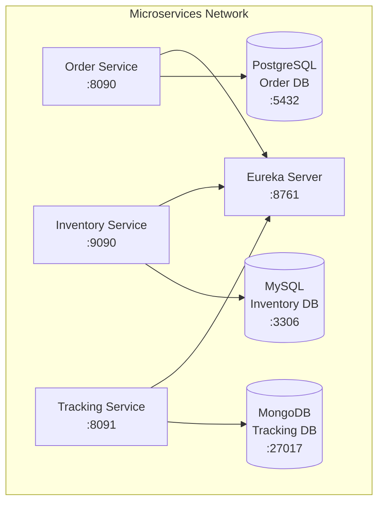

StreamLine Logistics uses Docker Compose to orchestrate all microservices and their dependencies. This guide explains the Docker setup in detail.

## Docker Compose Overview

The project uses a single `docker-compose.yml` file that defines:

- 3 microservices (Order, Inventory, Tracking)
- 1 service discovery server (Eureka)
- 3 databases (PostgreSQL, MySQL, MongoDB)
- 1 custom bridge network
- 3 persistent volumes

## Architecture



## Complete Docker Compose Configuration

Here's the complete `docker-compose.yml` from the project:

```yaml
services:
  eureka-server:
    container_name: eureka-server
    build:
      context: .
      dockerfile: ./microservice-eureka/Dockerfile
    image: eureka-service:latest
    ports:
      - "8761:8761"
    networks:
      - microservices-network
    
  order-service:
    container_name: order-service
    build:
      context: .
      dockerfile: ./microservice-order/Dockerfile
    image: order-service:latest
    ports:
      - "8090:8090"
    networks:
      - microservices-network
    depends_on:
      - eureka-server
  
  inventory-service:
    container_name: inventory-service
    build:
      context: .
      dockerfile: ./microservice-inventory/Dockerfile
    image: inventory-service:latest
    ports: 
      - "9090:9090"
    networks:
      - microservices-network
    depends_on:
      - eureka-server
  
  tracking-service:
    container_name: tracking-service
    build:
      context: .
      dockerfile: ./microservice-tracking/Dockerfile
    image: tracking-service:latest
    ports:
      - "8091:8091"
    networks:
      - microservices-network
    depends_on:
      - eureka-server
  
  order-db:
    container_name: order_db
    image: postgres:15
    restart: always
    environment:
      POSTGRES_USER: postgres
      POSTGRES_PASSWORD: password
      POSTGRES_DB: orderdb
    ports:
      - "5432:5432"
    networks:
      - microservices-network
    volumes:
      - orderdb-data:/var/lib/postgresql/data

  inventory-db:
    container_name: inventory_db
    image: mysql:8
    restart: always
    environment:
      MYSQL_ROOT_USER: root
      MYSQL_ROOT_PASSWORD: password
      MYSQL_DATABASE: inventorydb
    ports:
      - "3306:3306"
    networks:
      - microservices-network
    volumes:
      - inventorydb-data:/var/lib/mysql
  
  traking-db:
    container_name: tracking_db
    image: mongo:latest
    restart: always
    environment:
      MONGO_INITDB_ROOT_USERNAME: root
      MONGO_INITDB_ROOT_PASSWORD: password
    ports:
      - "27017:27017"
    networks:
      - microservices-network
    volumes:
      - trackingdb-data:/data/db

networks:
  microservices-network:
    driver: bridge

volumes:
  orderdb-data:
  inventorydb-data:
  trackingdb-data:
```

## Service Breakdown

### Eureka Server

Service discovery and registration server.

```yaml
eureka-server:
  container_name: eureka-server
  build:
    context: .
    dockerfile: ./microservice-eureka/Dockerfile
  image: eureka-service:latest
  ports:
    - "8761:8761"
  networks:
    - microservices-network
```

**Key Points:**
- Runs on port `8761`
- No dependencies (starts first)
- Dashboard accessible at http://localhost:8761
- All other services register with this instance

### Order Service

Handles order management operations.

```yaml
order-service:
  container_name: order-service
  build:
    context: .
    dockerfile: ./microservice-order/Dockerfile
  image: order-service:latest
  ports:
    - "8090:8090"
  networks:
    - microservices-network
  depends_on:
    - eureka-server
```

**Key Points:**
- Runs on port `8090`
- Depends on Eureka Server
- Uses PostgreSQL database (order_db)
- Connects to database at `order_db:5432`

### Inventory Service

Manages inventory and stock levels.

```yaml
inventory-service:
  container_name: inventory-service
  build:
    context: .
    dockerfile: ./microservice-inventory/Dockerfile
  image: inventory-service:latest
  ports: 
    - "9090:9090"
  networks:
    - microservices-network
  depends_on:
    - eureka-server
```

**Key Points:**
- Runs on port `9090`
- Depends on Eureka Server
- Uses MySQL database (inventory_db)
- Connects to database at `inventory_db:3306`
- Includes OpenAPI/Swagger documentation

### Tracking Service

Tracks shipment status and location.

```yaml
tracking-service:
  container_name: tracking-service
  build:
    context: .
    dockerfile: ./microservice-tracking/Dockerfile
  image: tracking-service:latest
  ports:
    - "8091:8091"
  networks:
    - microservices-network
  depends_on:
    - eureka-server
```

**Key Points:**
- Runs on port `8091`
- Depends on Eureka Server
- Uses MongoDB database (tracking_db)
- Connects to database at `tracking_db:27017`

## Database Configuration

### PostgreSQL (Order Database)

```yaml
order-db:
  container_name: order_db
  image: postgres:15
  restart: always
  environment:
    POSTGRES_USER: postgres
    POSTGRES_PASSWORD: password
    POSTGRES_DB: orderdb
  ports:
    - "5432:5432"
  networks:
    - microservices-network
  volumes:
    - orderdb-data:/var/lib/postgresql/data
```

**Configuration:**
- **Image**: PostgreSQL 15
- **Database**: orderdb
- **User**: postgres
- **Password**: password
- **Port**: 5432
- **Volume**: orderdb-data (persistent storage)

<Warning>
Change the default password in production environments.
</Warning>

### MySQL (Inventory Database)

```yaml
inventory-db:
  container_name: inventory_db
  image: mysql:8
  restart: always
  environment:
    MYSQL_ROOT_USER: root
    MYSQL_ROOT_PASSWORD: password
    MYSQL_DATABASE: inventorydb
  ports:
    - "3306:3306"
  networks:
    - microservices-network
  volumes:
    - inventorydb-data:/var/lib/mysql
```

**Configuration:**
- **Image**: MySQL 8
- **Database**: inventorydb
- **Root User**: root
- **Root Password**: password
- **Port**: 3306
- **Volume**: inventorydb-data (persistent storage)

### MongoDB (Tracking Database)

```yaml
traking-db:
  container_name: tracking_db
  image: mongo:latest
  restart: always
  environment:
    MONGO_INITDB_ROOT_USERNAME: root
    MONGO_INITDB_ROOT_PASSWORD: password
  ports:
    - "27017:27017"
  networks:
    - microservices-network
  volumes:
    - trackingdb-data:/data/db
```

**Configuration:**
- **Image**: MongoDB latest
- **Root Username**: root
- **Root Password**: password
- **Port**: 27017
- **Volume**: trackingdb-data (persistent storage)

<Note>
Note the typo in the service name: `traking-db` should be `tracking-db`.
</Note>

## Networking

### Bridge Network

```yaml
networks:
  microservices-network:
    driver: bridge
```

All services run on a custom bridge network named `microservices-network`. This allows:

- Container-to-container communication using container names
- Isolated network from other Docker containers
- DNS resolution for service discovery

**Example:** Order Service connects to PostgreSQL using hostname `order_db` instead of `localhost`.

## Persistent Volumes

```yaml
volumes:
  orderdb-data:
  inventorydb-data:
  trackingdb-data:
```

Docker volumes ensure data persistence across container restarts:

| Volume | Database | Purpose |
|--------|----------|----------|
| orderdb-data | PostgreSQL | Stores order data |
| inventorydb-data | MySQL | Stores inventory data |
| trackingdb-data | MongoDB | Stores tracking data |

### Managing Volumes

<CodeGroup>
```bash List volumes
docker volume ls | grep streamline
```

```bash Inspect volume
docker volume inspect <volume-name>
```

```bash Backup volume
docker run --rm -v <volume-name>:/data -v $(pwd):/backup \
  ubuntu tar czf /backup/backup.tar.gz /data
```

```bash Remove volumes
# Remove all volumes (deletes data!)
docker compose down -v
```
</CodeGroup>

## Docker Commands Reference

### Starting Services

<CodeGroup>
```bash Start all services
docker compose up -d
```

```bash Start with logs
docker compose up
```

```bash Start specific service
docker compose up -d order-service
```

```bash Rebuild and start
docker compose up -d --build
```
</CodeGroup>

### Stopping Services

<CodeGroup>
```bash Stop all services
docker compose stop
```

```bash Stop specific service
docker compose stop order-service
```

```bash Stop and remove containers
docker compose down
```

```bash Stop and remove everything
docker compose down -v --rmi all
```
</CodeGroup>

### Monitoring Services

<CodeGroup>
```bash View all logs
docker compose logs -f
```

```bash View service logs
docker compose logs -f order-service
```

```bash Check service status
docker compose ps
```

```bash View resource usage
docker stats
```
</CodeGroup>

### Service Management

<CodeGroup>
```bash Restart service
docker compose restart order-service
```

```bash Execute command in container
docker compose exec order-service bash
```

```bash View service configuration
docker compose config
```

```bash Scale service (if applicable)
docker compose up -d --scale order-service=3
```
</CodeGroup>

## Dockerfile Examples

While the complete Dockerfiles are in each microservice directory, they typically follow this pattern:

```dockerfile
FROM eclipse-temurin:17-jdk-alpine

WORKDIR /app

COPY microservice-*/target/*.jar app.jar

EXPOSE <port>

ENTRYPOINT ["java", "-jar", "app.jar"]
```

## Environment-Specific Configurations

### Development Environment

For local development, you might want to modify `docker-compose.yml`:

```yaml
order-service:
  # ... other config
  environment:
    - SPRING_PROFILES_ACTIVE=dev
  volumes:
    - ./microservice-order/src:/app/src  # Hot reload
```

### Production Environment

Create a separate `docker-compose.prod.yml`:

```yaml
services:
  order-db:
    environment:
      POSTGRES_PASSWORD: ${DB_PASSWORD}  # Use secrets
    deploy:
      resources:
        limits:
          cpus: '0.5'
          memory: 512M
```

Use with:

```bash
docker compose -f docker-compose.yml -f docker-compose.prod.yml up -d
```

## Troubleshooting

### Container Won't Start

```bash
# Check container logs
docker compose logs <service-name>

# Check container status
docker compose ps -a

# Inspect container
docker inspect <container-name>
```

### Network Issues

```bash
# List networks
docker network ls

# Inspect network
docker network inspect microservices-network

# Recreate network
docker compose down
docker network prune
docker compose up -d
```

### Volume Issues

```bash
# Check volume mounts
docker inspect <container-name> | grep -A 10 Mounts

# Clean unused volumes
docker volume prune
```

### Database Connection Issues

```bash
# Test PostgreSQL connection
docker compose exec order-service nc -zv order_db 5432

# Test MySQL connection
docker compose exec inventory-service nc -zv inventory_db 3306

# Test MongoDB connection
docker compose exec tracking-service nc -zv tracking_db 27017
```

## Performance Optimization

### Resource Limits

Add resource constraints to prevent any service from consuming too many resources:

```yaml
order-service:
  # ... other config
  deploy:
    resources:
      limits:
        cpus: '1.0'
        memory: 1G
      reservations:
        cpus: '0.5'
        memory: 512M
```

### Health Checks

Add health checks for better orchestration:

```yaml
order-service:
  # ... other config
  healthcheck:
    test: ["CMD", "curl", "-f", "http://localhost:8090/actuator/health"]
    interval: 30s
    timeout: 10s
    retries: 3
    start_period: 40s
```

## Next Steps

- Review [Configuration](/setup/configuration) for detailed service configuration
- Learn about customizing environment variables
- Explore production deployment strategies